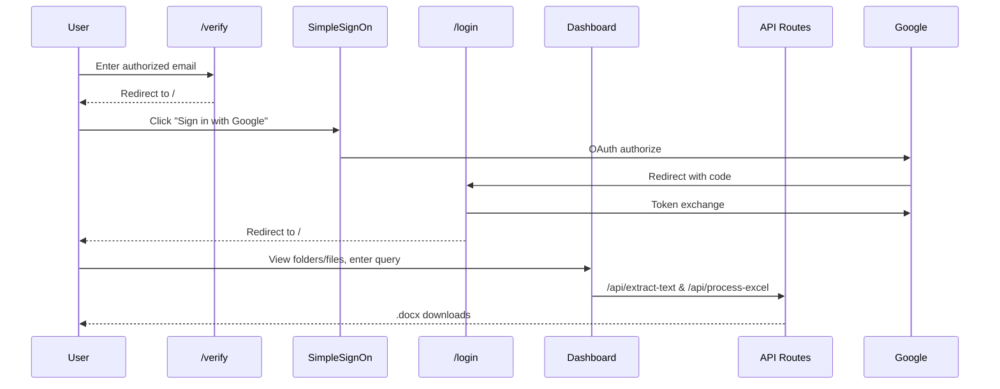

## Metatech Industries — Report Generation Dashboard

Comprehensive Knowledge Transfer (KT) Documentation

### 1. Project Overview

- Purpose: Internal dashboard for content search across Google Drive, previewing and downloading files, extracting content from Word/Docs, and generating consolidated .docx reports from Word and Excel sources.
- Problems solved:
  - Centralized Google Drive search (by content) across My Drive, Shared drives, and Shared-with-me.
  - OAuth-based Google sign-on with token validation/refresh.
  - One-click extraction and combination of document contents into a Word report.
  - Excel scanning to locate rows matching a search term and compile results into a formatted .docx.
- Tech stack:
  - Frontend: Next.js 15, React 18, Tailwind CSS
  - Backend: Next.js API Routes
  - Auth/Storage: Google OAuth 2.0, Google Drive API v3
  - Document Processing: docx, ExcelJS, mammoth, word-extractor, libreoffice-convert
  - Utilities: axios, js-cookie
- High-level scope: Verify email access, authenticate via Google, explore Drive folders/files, search by content, extract and combine content, and download final reports.

### 2. Functional Documentation

- Login/Verification
  - Email gate via `/verify` with allowed emails list.
  - OAuth flow initiated by `components/SimpleSignOn.js`. Redirect handling in `pages/login.js` exchanges code for tokens and stores `access_token`, `refresh_token`, and user profile.
- Dashboard
  - `pages/index.js` renders main UI inside `SimpleSignOn` and `Layout`. Shows current user email from `localStorage`. Provides search and displays Drive folders/files.
- Google Drive Browsing
  - `components/PlayBookFolders.js`: lists folders for current `fid` (route param). Also shows "Shared With Me" on dashboard.
  - `components/PlayBookFiles.js`: lists non-folder files in current `fid`, with size/date, and opens file in Drive.
  - `pages/list/[fid].js`: drill-down page (folder-level view) hosting `FolderName`, search, folders, and files.
- Search and Content Extraction
  - `components/GoogleDriveSearch.js`:
    - Filters: folder, file type (Docs, Word, Excel, Google Docs, etc.).
    - Searches via Drive `fullText contains` across the current folder and optionally subfolders or shared-with-me.
    - Batch extraction:
      - Documents: downloads and posts to `/api/extract-text` for text extraction; aggregates and posts to `/api/combine-files` to produce a combined Word file.
      - Excel/Sheets: downloads or exports to XLSX, posts to `/api/process-excel` which scans sheets for query matches and returns a .docx summary table per sheet.
    - Provides progress UI and “Download Again”.
- Token Management
  - Access token validation and refresh in `components/SimpleSignOn.js` and helper `components/HandleAccessTokenExpiration.js`.
  - A custom event `tokenValidated` triggers initial data fetches after auth.

Feature-to-file mapping

- Auth: `components/SimpleSignOn.js`, `pages/login.js`, `pages/_app.js`, `config.json`
- Email verify gate: `pages/verify.js`
- Layout/Chrome: `components/Layout.js`, `components/Navbar.js`, `components/Sidebar.js`
- Drive browsing: `components/PlayBookFolders.js`, `components/PlayBookFiles.js`, `pages/list/[fid].js`, `components/FolderName.js`
- Search/extraction: `components/GoogleDriveSearch.js`
- API routes:
  - Combine Word files: `pages/api/combine-files.js`
  - Extract text from docs: `pages/api/extract-text.js`
  - Process Excel: `pages/api/process-excel.js`
  - Download generated file: `pages/api/download-file.js`
- Config: `config.json`
- Next.js config: `next.config.js` (raised body/response limits)

### 3. Workflow Diagrams

High-level system flow

```mermaid
flowchart LR
  A[User] --> B[Verify /verify]
  B -->|authorized| C[SimpleSignOn]
  C --> D[OAuth Consent]
  D --> E[/login: exchange code]
  E --> F[Store tokens + user profile]
  F --> G[Dashboard /]
  G --> H[Search & Browse Drive]
  H --> I[Extract & Download via API routes]
```

User journey: login → dashboard → search → extract → download



Backend processing: document and excel

```mermaid
flowchart TD
  subgraph Docs
    A(files[], query) --> B[/api/extract-text]
    B -->|cleaned text| C[aggregate results]
    C --> D[/api/combine-files]
    D --> E[(.docx)]
  end

  subgraph Excel
    F(files[], query) --> G[/api/process-excel]
    G --> H[scan worksheets, build tables]
    H --> I[(.docx)]
  end
```

### 4. Technical Documentation

- Architecture
  - Frontend: Next.js pages and React components. Client-side calls to Google APIs using `access_token`.
  - Backend: Next.js API routes for processing files and returning .docx buffers.
  - Data: No DB; relies on Drive APIs and in-memory processing. Temporary downloads handled client-side; server reads/writes buffers only.
  - Auth: OAuth 2.0 Authorization Code with tokens stored in `localStorage`.

- Module Breakdown
  - `pages/_app.js`: global CSS and component wrapper.
  - `pages/index.js`: main dashboard composition.
  - `pages/verify.js`: allowlist form; writes `isVerified` and `userEmail`.
  - `pages/login.js`: token exchange and userinfo fetch.
  - `components/SimpleSignOn.js`: token validation/refresh, profile fetch, guards children.
  - `components/GoogleDriveSearch.js`: search UI, Drive queries, batching, calling APIs to generate Word reports.
  - `components/PlayBookFolders.js` / `components/PlayBookFiles.js` / `components/FolderName.js`: browsing UI against Drive.
  - `components/Layout.js` / `components/Navbar.js` / `components/Sidebar.js`: application chrome.
  - `pages/api/extract-text.js`: parse uploaded or base64 doc/docx; converts .doc -> .docx via libreoffice, else word-extractor fallback; returns cleaned lines.
  - `pages/api/combine-files.js`: build a .docx with metadata header and file sections; streams buffer to client.
  - `pages/api/process-excel.js`: ExcelJS to scan sheets, build table rows where columns 3 or 4 match query; compiles docx with summary.
  - `pages/api/download-file.js`: serve a file from `temp` by name.

- Database Schema
  - None.

- API Documentation
  - POST `/api/extract-text`
    - Purpose: Extract text from one or more files.
    - Request: multipart/form-data with `file` OR JSON:
      - Single: `{ "fileData": base64, "mimeType": string, "fileName": string }`
      - Batch: `{ "files": [{ "fileData", "mimeType", "fileName" }, ...] }` or `[{...}, ...]`
    - Response:
      - Single: `{ "extractedText": string }`
      - Batch: `{ "results": [{ "fileName", "extractedText", "error"? }, ...] }`
  - POST `/api/combine-files`
    - Purpose: Combine multiple extracted texts into a .docx with header (query, counts, timestamps).
    - Request: `{ "files": [{ "fileName", "extractedText" }, ...], "query"?: string }`
    - Response: binary .docx buffer with `Content-Disposition: attachment; filename=<generated>.docx`
  - POST `/api/process-excel`
    - Purpose: Scan Excel files for rows matching query and return docx with tables.
    - Request: `{ "files": [{ "fileName", "fileData(base64)" }, ...], "query": string }`
    - Response: binary .docx buffer with filename `<query>_<date>_<time>.docx`
  - GET `/api/download-file?fileName=<name>`
    - Purpose: Download a previously created file from `temp`.
    - Response: file stream or JSON error.

Request/response samples

```json
POST /api/extract-text
{
  "fileData": "<base64>",
  "mimeType": "application/vnd.openxmlformats-officedocument.wordprocessingml.document",
  "fileName": "Report.docx"
}
```

```json
200 OK
{ "extractedText": "Line 1\nLine 2\n..." }
```

```json
POST /api/combine-files
{
  "query": "pump",
  "files": [
    { "fileName": "A.docx", "extractedText": "..." },
    { "fileName": "B.doc", "extractedText": "..." }
  ]
}
```

Response headers include:
`Content-Type: application/vnd.openxmlformats-officedocument.wordprocessingml.document`
`Content-Disposition: attachment; filename=<generated>.docx`

```json
POST /api/process-excel
{
  "query": "acme",
  "files": [
    { "fileName": "leads.xlsx", "fileData": "<base64>" }
  ]
}
```

Response headers include the same Word MIME type and attachment filename.

Auth scopes (from `config.json`)

- Drive read scopes, Docs access, and userinfo scopes used for profile; update Google Console credentials accordingly.

### 5. Configuration

- `config.json`:
  - `api.client_id`, `api.client_secret`, `api.scopes`
  - `directory.team_drive` for Shared Drive targeting (empty means all drives)
- `next.config.js`:
  - Increased API body size and response limits to 10MB. Adjust if needed for large Excel/Word files.

Environment and secrets

- Current repo stores `client_id` and `client_secret` in `config.json`. For production, move to environment variables and do not commit secrets.

### 6. Maintenance & KT Notes

- Common issues
  - 401 from Google APIs: token expired; refresh logic in `SimpleSignOn`. Ensure `refresh_token` granted by using `access_type=offline&prompt=consent`.
  - Large files: body/response limits may need increasing. Also client-side caps Excel to ~10MB.
  - .doc parsing: legacy formats may extract little text; fallbacks and notes are present.
- Debugging
  - Network: inspect requests to Drive API and API routes in DevTools.
  - Server logs: Next.js API routes log detailed errors.
  - Optional: toggle console logs in `GoogleDriveSearch.js` for batch progression.
- Performance
  - Batch processing with concurrency limits for Excel and document processing.
  - Avoids SSR for browser-dependent components with `dynamic(..., { ssr: false })`.
  - Uses Drive query filters to minimize payloads (fields selection).
- Monitoring and scaling
  - Host API routes where `libreoffice-convert` is available if `.doc` support is required.
  - Consider moving heavy processing to serverless functions with sufficient memory or to a background worker.

### 7. Visual Enhancements

- Add screenshots:
  - Verify screen (`/verify`)
  - Dashboard with user info, search, folders/files
  - Results grid and progress indicators
- GIFs: End-to-end flow (verify → sign in → search → extract → download)
- Diagrams: Include Mermaid diagrams above in README for onboarding clarity.

### Getting Started

- Install
  - Node 18+, LibreOffice for `.doc` conversion (if server environment uses `libreoffice-convert`).
  - `npm install`
- Run
  - `npm run dev`
- Configure
  - Update `config.json` with proper OAuth credentials and allowed emails in `pages/verify.js`.
  - Ensure Google Cloud Console OAuth consent and Drive APIs enabled.

### Security Notes

- Move secrets out of `config.json` to environment variables.
- Limit allowed emails and consider using OAuth domain restrictions.
- Avoid storing long-lived tokens in `localStorage` for production; consider HttpOnly cookies and backend session.